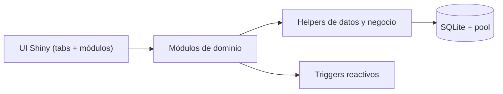

# CyberCECSo

Aplicación Shiny para la gestión de stock y pedidos a proveedores de la cantina de la facultad. Está diseñada para operar con un flujo simple de compras, recepción de mercadería, control de inventario por lotes y seguimiento de pagos, usando SQLite como base de datos local.

**Resumen**
Este repo contiene una app Shiny con autenticación por roles y una arquitectura modular. La lógica de negocio y acceso a datos está centralizada en helpers que trabajan sobre un pool de conexiones a SQLite. El inventario se maneja por lotes y ubicaciones, con trazabilidad mediante movimientos de stock y eventos de pedidos.

**Stack**
- `R`, `Shiny`, `bslib`
- `DBI`, `RSQLite`, `pool`
- `DT` para tablas interactivas
- `sortable` para el Kanban de pedidos
- `shinymanager` + `sodium` para autenticación

**Estructura**
- `app.R`: punto de entrada de la app Shiny.
- `global.R`: carga de paquetes, paths, helpers, módulos y creación del pool.
- `R/ui.R`: composición de UI global y tabs por rol.
- `R/server.R`: orquestación de módulos y estado compartido.
- `R/modules/`: módulos Shiny por dominio funcional.
- `R/helpers/`: acceso a datos, validaciones y reglas de negocio.
- `data/schema.sql`: esquema inicial de SQLite.
- `data/cybercecso.sqlite`: base de datos local (runtime).
- `tests/`: suite de tests con `testthat`.
- `usuarios.txt`: guía rápida para alta inicial de usuarios.

**Arquitectura**
La app sigue un patrón de capas simple:



**Decisiones**
- Se centraliza el acceso a datos en `R/helpers/` para evitar SQL duplicado y mantener consistencia.
- Se usa `pool::dbPool` para evitar abrir/cerrar conexiones por request.
- Operaciones críticas usan transacciones con `pool::poolWithTransaction`.
- El inventario se gestiona por lotes y ubicaciones para trazabilidad.
- Se registra historial en `movimientos_stock` y `pedidos_eventos`.

**Autenticación**
- `shinymanager::secure_app()` envuelve la UI y `secure_server()` valida credenciales.
- `check_credentials_db()` valida usuarios con hashes `sodium::password_store()`.
- Roles soportados: `admin` y `becarix`.
- Permisos clave: `admin` puede crear/editar proveedores, productos, ubicaciones, usuarios y pagos. `becarix` ve inventario, pedidos y movimientos, pero no crea pedidos ni gestiona maestros.

**Base De Datos**
Ubicación por defecto: `data/cybercecso.sqlite`. El esquema inicial se aplica con `data/schema.sql` si la base está vacía. Luego se ejecuta `ensure_schema_updates()` para migraciones incrementales.

Tablas principales:
- `usuarios`: credenciales y rol.
- `proveedores`: datos de proveedores.
- `productos`: catálogo con proveedor, unidad, precios y flags.
- `ubicaciones`: ubicaciones físicas para stock.
- `inventario`: stock por producto, lote y ubicación.
- `pedidos_proveedores`: cabecera de pedidos.
- `detalle_pedidos`: items solicitados por pedido.
- `recepciones_pedidos`: recepción única por pedido.
- `recepciones_detalle`: líneas recibidas (pedido y extras).
- `movimientos_stock`: trazabilidad de entradas/salidas/ajustes/vencimientos.
- `pedidos_eventos`: auditoría de acciones en pedidos.
- `pagos_proveedores`: pagos asociados a pedidos.

Relaciones y decisiones de diseño:
- `inventario` se relaciona con `productos` y `ubicaciones`. Cada fila representa un lote específico.
- `detalle_pedidos` y `recepciones_detalle` vinculan productos con pedidos y recepción.
- `movimientos_stock` referencia `pedidos_proveedores` para poder rastrear movimientos ligados a compras.
- `pedidos_eventos` registra acciones relevantes y usuario responsable.

Índices y trigger:
- Índices en campos de búsqueda frecuente (fechas, proveedor, estado, ubicación).
- Trigger `actualizar_fecha_inventario` actualiza `fecha_ultima_actualizacion` en cada `UPDATE` de inventario.

**Migraciones**
- `ensure_schema_updates()` agrega tablas/columnas/índices faltantes y migra estados de pedidos.
- Si la tabla `usuarios` está desactualizada y tiene datos, se fuerza migración manual para evitar pérdida.

**Módulos**

**Inventario (`mod_inventario`)**
- Vista consolidada por producto y vista detallada por lote.
- Filtro por vencimiento con semáforo de estados (`vencido`, `critico`, `proximo`, `sin_fecha`).
- Compra rápida genera pedido recibido al instante y actualiza inventario, movimientos y recepciones.
- Ajustes: soporta ajuste relativo (sumar/restar), ajuste absoluto (fijar stock objetivo), FEFO para salidas, vencimiento rápido para perecederos y movimiento de lotes entre ubicaciones con doble movimiento (salida/entrada) para trazabilidad.

**Pedidos (`mod_pedidos`)**
- Kanban con `sortable` para estados `pendiente`, `realizado`, `recibido`.
- Drag and drop dispara confirmación y cambio de estado.
- Al marcar `recibido`, se abre el flujo de recepción para cargar cantidades, vencimientos y ubicaciones.
- Se permite editar cantidad/precio del detalle mientras el pedido no esté `recibido`.
- Plantillas por proveedor para prellenar pedidos con cantidades fijas u objetivo de stock.
- Recepción genera movimientos de stock, inventario y detalle de recepción.
- Excedentes de lo pedido se registran como `extras` en `recepciones_detalle`.

**Movimientos (`mod_movimientos`)**
- Historial de stock con filtros por fecha, producto y tipo.
- Se refresca con triggers cuando hay compras, ajustes o recepciones.

**Pagos (`mod_pagos`)**
- Admin-only.
- Selección de pedido y resumen de monto, pagado y saldo.
- Registro, edición y eliminación de pagos con auditoría en `pedidos_eventos`.
- Permite fijar un monto de pedido manual para cuadrar saldos.

**Proveedores (`mod_proveedores`)**
- Admin-only.
- CRUD básico con validaciones mínimas en UI.
- Retorna un `reactive` usado por módulos de productos, inventario y pedidos.

**Productos y Ubicaciones (`mod_productos`)**
- Admin-only.
- CRUD de productos y ubicaciones.
- Eliminación de ubicación bloqueada si existen referencias en inventario o movimientos.
- Retorna `productos` y `ubicaciones` como reactives para el resto de módulos.

**Usuarios (`mod_usuarios`)**
- Admin-only.
- Alta de usuarios con hash `sodium`.
- No permite borrar el propio usuario ni el último admin.

**Helpers**

Consultas (`fetch_*`)
- `fetch_inventario(mode = consolidated|detailed|raw)` centraliza vistas y cálculos de vencimiento.
- `fetch_pedidos_kanban()` agrega montos, cantidades y pagos para el Kanban.
- `fetch_pedido_detalle()` y `fetch_pedido_extras()` abastecen la recepción.

Inserciones y actualizaciones
- CRUD básicos por entidad (`insert_*`, `update_*`, `delete_*`).
- `insert_pedido()` crea pedidos y detalle, calcula monto estimado desde precios actuales.
- `update_detalle_pedido()` permite editar o eliminar líneas si cantidad < 0.
- `update_pedido_estado()` actualiza fechas según estado (`realizado` o `recibido`).
- `update_pedido_monto()` fija monto total manual con auditoría.

Operaciones de stock
- `register_purchase_transaction()` realiza una compra rápida completa: crea pedido + recepción, genera lote con prefijo `YYYYMMDD` y sufijo alfabético, registra movimientos e inventario.
- `register_pedido_recepcion()` procesa recepciones formales: valida vencimientos, actualiza detalle, crea extras si se recibe de más, actualiza inventario y movimientos.
- `register_adjustment()` valida stock negativo y actualiza inventario + movimientos.
- `move_inventario_lote()` mueve stock entre ubicaciones, fusionando lotes si aplica.

Validaciones
- `validate_expiry_not_past()` bloquea vencimientos en el pasado.
- `normalize_scalar()` normaliza inputs singulares desde Shiny.

**Flujos**

Compra rápida
1. Se elige proveedor y cantidades en inventario.
2. `register_purchase_transaction()` crea pedido recibido, recepción y movimientos.
3. Se actualiza inventario por lote y ubicación.

Recepción de pedido
1. Se completa recepción desde Kanban.
2. `register_pedido_recepcion()` valida vencimientos y cantidades.
3. Se actualiza detalle, recepciones, inventario y movimientos.

Ajuste de stock
1. Se define tipo y cantidad (o stock objetivo).
2. `register_adjustment()` registra movimiento y ajusta inventario.
3. FEFO descuenta lotes por fecha de vencimiento.

**Tests**
- Tests en `tests/testthat/` cubren helpers, migraciones y reglas críticas.

Unitarios:
```r
# En una sesión R
install.packages("testthat")
Sys.setenv(TESTTHAT = "true")
testthat::test_dir("tests/testthat")
# o
shiny::runTests()
```


**Ejecución Local**

```r
# En una sesión R
install.packages("renv")
renv::restore()
shiny::runApp()
```

**Usuarios**
Ver `usuarios.txt` para ejemplos. Flujo típico:

```r
source("global.R")
insert_usuario(pool, "admin1", "clave-segura", rol = "admin", nombre = "Coordi 1")
```

**Operación**
- La base `data/cybercecso.sqlite` se crea automáticamente si no existe.
- `global.R` define `DB_PATH` y `SCHEMA_PATH` en base al directorio del proyecto.
- Al detener la app, el pool se cierra automáticamente con `onStop()`.
